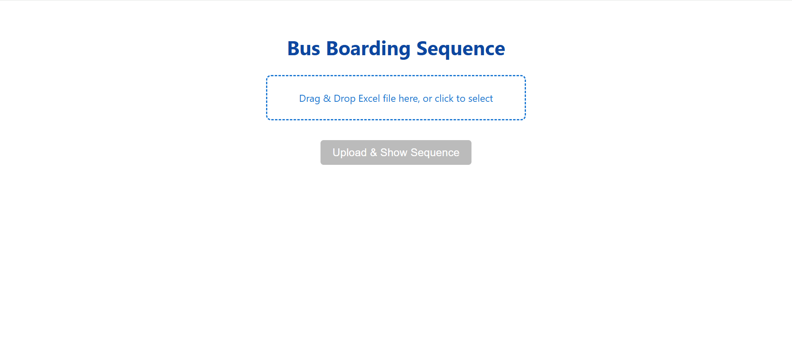

# Bus Boarding Sequence Generator

A minimal web app to generate optimal bus boarding sequences from Excel seat booking files, using smart validation and prioritization rules.

## Features

- **Drag \& Drop Excel Upload:** Clean UI with whitespace, intuitive workflow for quick file uploads.
- **Priority Logic:** Boards bookings by farthest back seat first. If tied in row, gives preference to window seats, then middle, then aisle seats.
- **Contextual Error/Warning Messages:** Errors for missing files are shown next to upload. Warnings for invalid seats are shown below the results.
- **Results Table:** Displays a structured, easy-to-read sequence immediately.
- **Export Options:** Download as CSV or print a clean, minimal layout.


## Getting Started

### Prerequisites

- Node.js and npm installed
- (Optionally) Chrome or any modern browser


### Installation

1. **Clone this repo:**

```
git clone https://github.com/yourusername/bus-boarding-sequence.git
cd bus-boarding-sequence
```

2. **Install dependencies:**

```
npm install
```

3. **Start the server:**

```
node server.js
```

4. **Open the UI:**
Open `index.html` in your browser (or host with any lightweight static server).



![Alt text]Resources/Images/Screenshot 2025-09-26 023109.png)

**Note:** Make sure your backend (`server.js`) is running at `localhost:3000` for uploads to work.

## Usage

1. Prepare your seat bookings Excel file (must contain Booking ID and Seats columns).
2. Open the app and drag/drop or select your Excel file.
3. View the generated boarding sequence.
4. Export results or print as needed.

## Board Sequence Rules

- Valid seat row letters are restricted to **A–F**
- Only bookings with valid seats are processed
- Bookings with farthest back seat row are prioritized
- If tied in row, window seats (A, F) board first, then middle (B, E), then aisle (C, D)


## Error \& Warning Handling

- **Missing file:** Red error message near the upload area
- **Invalid seats:** Yellow warning bar below the table
- **Success:** Green message on valid sequence


## Export \& Sharing

- Print-friendly output (only the boarding sequence table)
- Download as CSV


## Folder Structure

```
bus-boarding-sequence/
├── index.html       # UI (open in browser)
├── server.js        # Node.js backend API
├── README.md        # This file
├── package.json     # Node dependencies
```

Feel free to fork, share, or contribute! For issues or improvements, open a GitHub issue or pull request.

